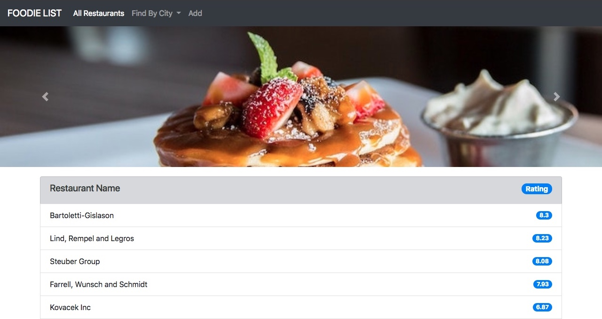
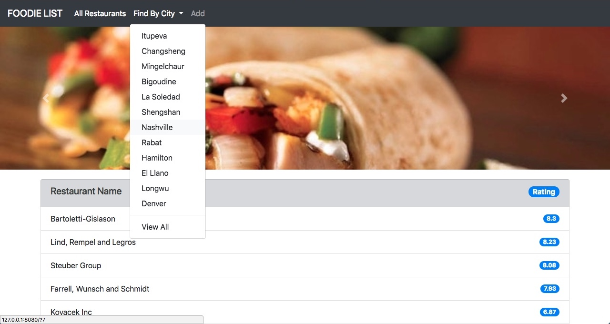
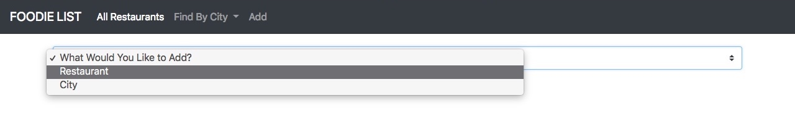
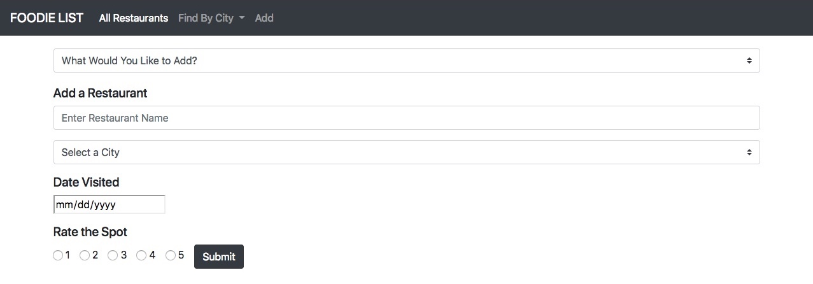

# FOODIE
Foodie, a single page web app, allows users to add and view all the restaurants they have been to with ratings. It also allows the user to filter restaurants by city. Users can also add additional cities and the purpose of their trip.

## Project Setup
To clone this project, run the following in your command line.
```
git clone https://github.com/drteresavasquez/foodie-list.git
cd foodie-list
cd lib
npm install
grunt
hs -o
```

## Demo

Site Deployed: https://drteresavasquez.github.io/foodie-list/

### Home Screen


### Filter By City


### View By City


### Add Either Restaurant or City


### Add Restaurant


### Add City


## Data
You may either use the local data or upload to Firebase, which is what this project uses to access the data.

If you choose to use the local data, you will need to update the calls to the JSON files and update the data that is returned in the promise.

Currently, using Firebase, the call looks like this:
```Javascript
function getData(file) {
    return $.ajax({
        url: file
    });
}

getData(`${firebaseURL}restaurants.json`)
        .then((data) => {
            console.log(data);
        });
```
To use local data, the call would look like this:
```Javascript
function getData(file) {
    return $.ajax({
        url: file
    });
}

getData(`data/restaurants.json`)
        .then((data) => {
            console.log(data);
        });
```
You will need to update the content of the functions in order to parse the local data. 

### Add Data to Firebase
Create a new DB and upload the foodie.json.

Update your database rules to the following:
```JSON
{
  "rules": {
    ".read": true,
    ".write": true,
      "foodie":{
          "restaurants": {
                ".indexOn": ["city_id","my_rating","restaurant"]
              },
            "cities": {
                ".indexOn": ["id","city"]
              }
        }
    }
  }
```
Setup permissions to allow `localhost` to access the database under authorization and Authorized domains.

Here is some sample data:
```JSON
{
    "restaurants": [
      {
        "id": 1,
        "restaurant": "Schaefer, DuBuque and Satterfield",
        "city_id": 4,
        "date_visited": "6/25/2017",
        "my_rating": 4.52
      }, {
        "id": 2,
        "restaurant": "Hegmann-Kuphal",
        "city_id": 5,
        "date_visited": "7/3/2016",
        "my_rating": 1.26
      }
    ],
    "cities": [
        {
          "id": 1,
          "city": "Itupeva",
          "trip_purpose": "lectus vestibulum quam sapien varius ut blandit non interdum in"
        }, {
          "id": 2,
          "city": "Changsheng",
          "trip_purpose": "blandit mi in porttitor pede justo eu massa donec dapibus duis at velit eu"
        }
      ]
  }
```

## Built With

* Bootstrap 4
* Firebase
* JavaScript/JQuery

## Contributors

* **Dr. Teresa Vasquez** - *Initial work* - [GitHub](https://github.com/drteresavasquez)
